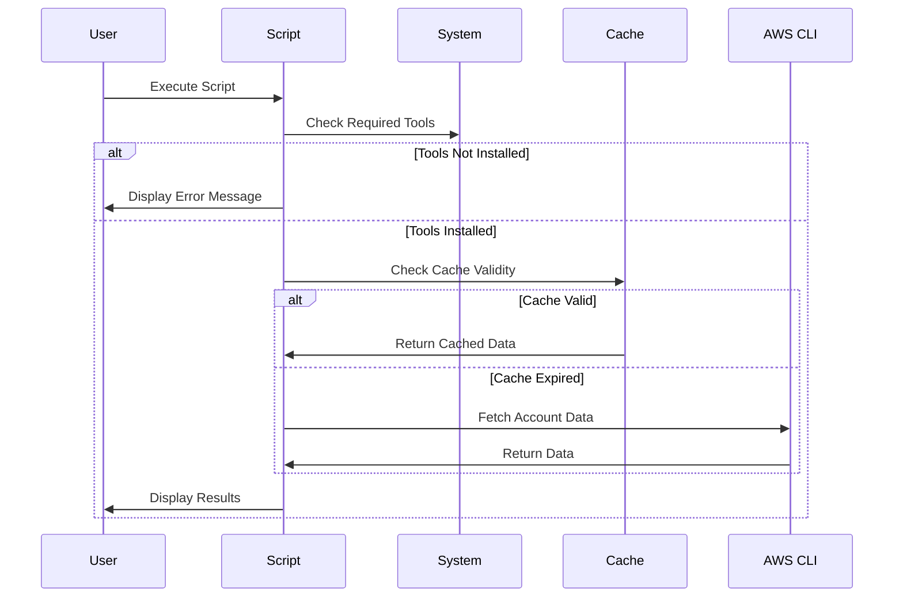

# AWS Cost Analysis Script

This document provides an overview of the AWS Cost Analysis Script, its functionality, setup, and usage instructions, including sequence and process diagrams to illustrate the flow.

---

## Overview
The AWS Cost Analysis Script is a Bash utility designed to:
- Analyze AWS account costs over a specified number of days.
- Highlight cost variations using color-coded thresholds.
- Display formatted daily costs with trend indicators and aligned headers.

The script relies on AWS CLI, `jq`, and `bc` for its operations.

---

## Prerequisites

### Required Tools
- AWS CLI
- jq
- bc

Ensure these tools are installed and available in your system PATH.

### Cache Directory
The script uses a cache directory to store temporary data and account name mappings:
- Cache directory: `$HOME/.aws_cost_analysis_cache`
- Cache expiry: 1 hour (3600 seconds)

---

## Usage

### Command Options
- `-h, --help` : Display help message.
- `-d, --days DAYS` : Analyze costs for the last `DAYS` days (default: 8).
- `--no-cache` : Bypass cached account data and fetch fresh information.
- `--no-color` : Disable color-coded output.

### Example Commands
1. Analyze costs for the last 8 days:
   ```bash
   ./aws_cost_analysis.sh
   ```
2. Analyze costs for the last 30 days:
   ```bash
   ./aws_cost_analysis.sh -d 30
   ```
3. Analyze costs without using cache:
   ```bash
   ./aws_cost_analysis.sh --no-cache
   ```
4. Disable color-coded output:
   ```bash
   ./aws_cost_analysis.sh --no-color
   ```

---

## Sequence Diagram
The following sequence diagram illustrates the script’s execution flow:



---

## Process Diagram
The process diagram below illustrates the main operations:


---

## Output Details

### On-Screen Output
- **Account Names**: Aligned to the left, displaying either cached or freshly fetched names.
- **Dates**: Displayed both as column headers and as rows beneath the dashed line.
- **Daily Costs**: Color-coded based on thresholds, with arrows indicating trends.
- **Totals**: Displayed at the bottom in cyan.

### Sample Output
Below is a sample output from the script:

```
AWS Cost Analysis Report
Period: 2025-01-06 to 2025-01-13
All amounts in USD

Account                                01-06       01-07       01-08       01-09       01-10       01-11       01-12       01-13
--------------------------------------------------------------------------------------------------------------------------------
example-account-1                     85.58↓      83.17↓      82.82↓      82.78↓      82.72↓      82.11↓      81.91↓      78.26↓
example-account-2                    192.94↑     193.24↓     193.02↓     192.67↓     193.50↑     192.32↓     192.15↓     181.35↓
example-account-3                    632.29↓     611.67↓     584.16↓     573.17↓     647.94↑     690.24↑     700.41↑     644.53↓
TOTAL                                910.81↓     888.08↓     860.00↓     848.62↓     924.16↑     964.67↑     974.47↑     903.14↓
```

---

## Additional Notes

1. The cache directory is located at `$HOME/.aws_cost_analysis_cache`.
2. The script dynamically aligns column headers and values for better readability.
3. AWS CLI must be configured with appropriate permissions to access cost data.

